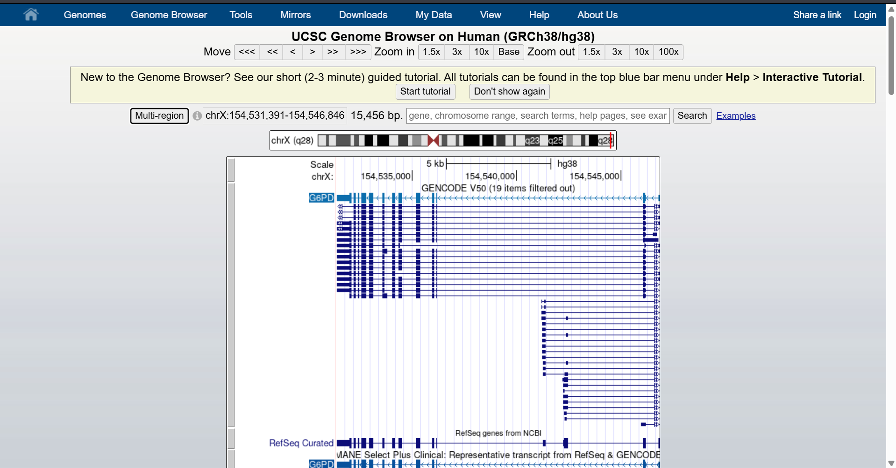
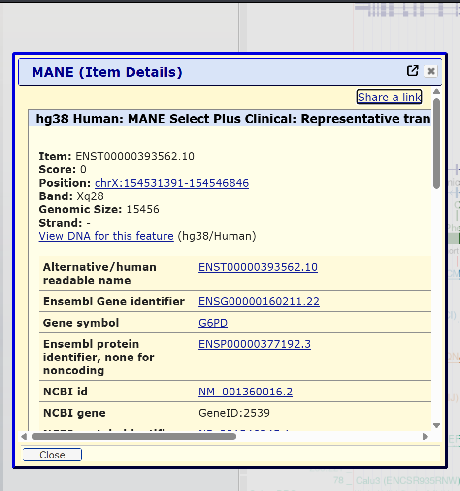
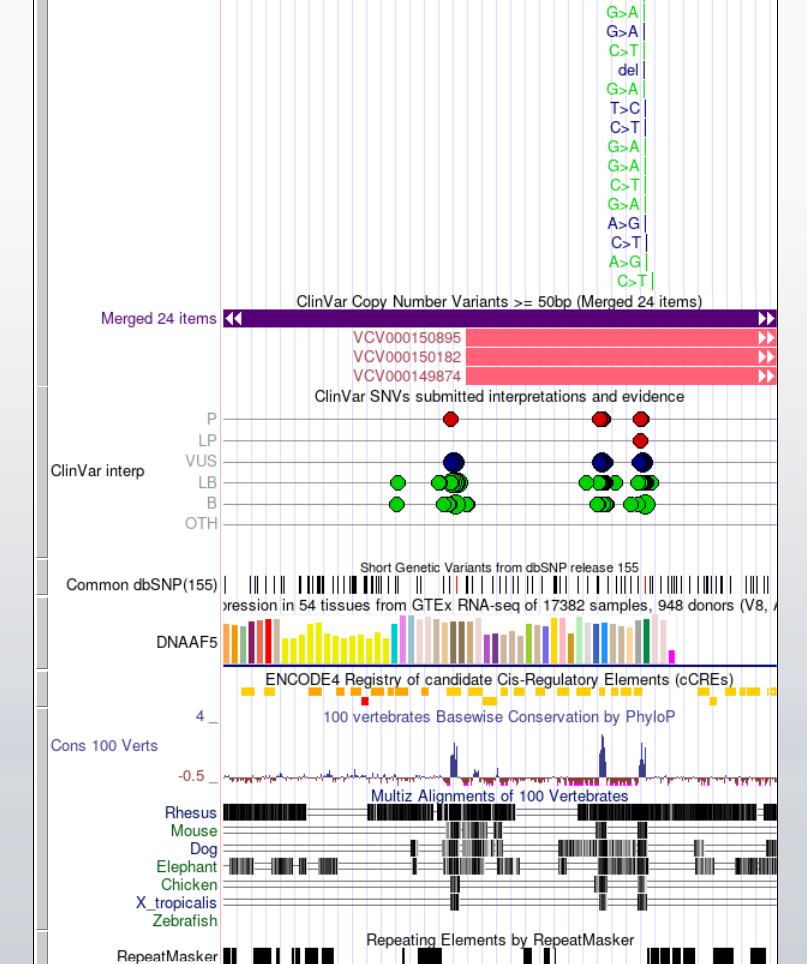
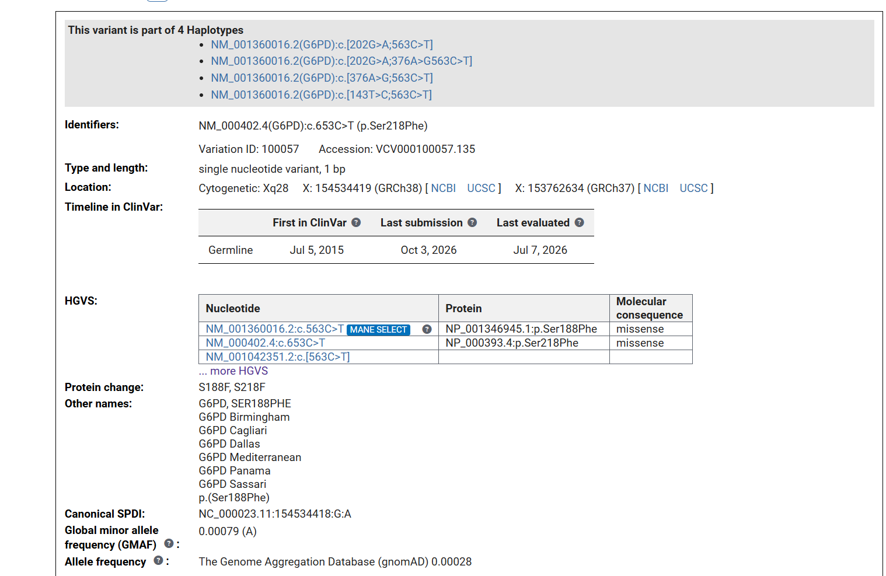
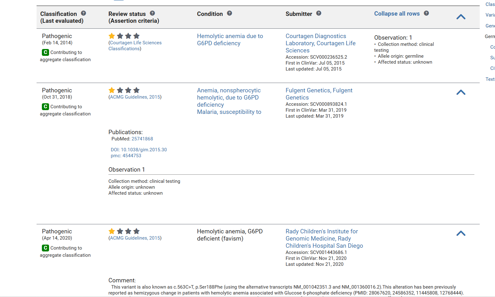
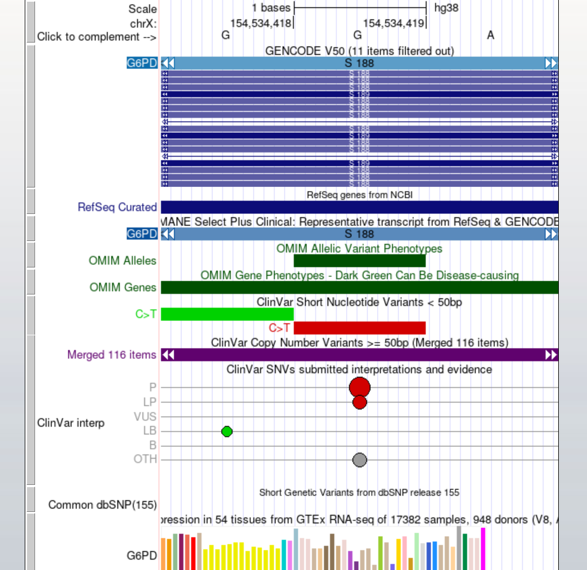

# Exploring a Human Disease Gene Using UCSC Genome Browser and NCBI ClinVar

**Name:** Shekhan Fredianne C. Trayvilla  
**Assigned Gene:** G6PD  
**Associated Disease:** G6PD Deficiency  
**Activity:** Bioinformatics Lab Activity - Exploring a Human Disease Gene Using UCSC Genome Browser and NCBI ClinVar

## 1. Assigned Gene and Disease

The assigned gene for this activity is **G6PD (glucose-6-phosphate dehydrogenase)**. Variants in this gene are associated with **G6PD deficiency**.

## 2. UCSC Gene Location

I searched for **G6PD** in the UCSC Genome Browser using the human **GRCh38/hg38** genome assembly.

- **Official gene symbol:** G6PD
- **Full gene name:** Glucose-6-phosphate dehydrogenase
- **Chromosome:** X
- **Genome assembly:** GRCh38/hg38
- **Genomic coordinates shown in UCSC:** chrX:154,531,391-154,546,846
- **DNA strand:** Negative (-)
- **Approximate gene size:** 15.5 kb

### Screenshot 1 - Gene Location

The UCSC Genome Browser showed G6PD on chromosome X at Xq28. The arrows in the gene model point toward the left, indicating that G6PD is located on the negative strand.

## 3. Exons, Introns, and Transcripts

I examined the **NCBI RefSeq, MANE, and GENCODE** gene annotation tracks in UCSC. Multiple transcript isoforms of G6PD were visible.

For the representative **MANE Select transcript ENST00000393562.10 / NM_001360016.2**, multiple exon blocks were visible. The exon boxes are separated by connecting lines representing introns.

- **Multiple transcripts/isoforms visible:** Yes
- **Selected transcript:** MANE Select, NM_001360016.2
- **Number of exons:** 13
- **Introns vs. exons:** The introns generally appear longer than the exons.

An **exon** is a portion of a gene that remains in the mature RNA after RNA processing, while an **intron** is a sequence located between exons that is removed during RNA splicing.

### Screenshot 2 - Gene Structure

## 4. UCSC Annotation Tracks

I displayed additional annotation tracks to examine clinical variants and sequence conservation around G6PD.

- **Gene annotation tracks used:** NCBI RefSeq, MANE, and GENCODE
- **ClinVar-related variants visible:** Yes
- **Conservation track:** UCSC 100 Vertebrates
- **Conservation pattern:** Some regions showed stronger conservation signals than others.
- **Relationship to gene structure:** Strong conservation signals were visible in several regions overlapping or near gene features, although conservation was not uniform throughout the gene.

Strong conservation across different species can suggest that a DNA sequence has an important biological function. Changes in highly conserved regions may be more likely to affect important gene or protein functions, although conservation alone does not prove that a variant causes disease.

### Screenshot 3 - ClinVar and Conservation Tracks

## 5. Selected ClinVar Variant

I searched NCBI ClinVar for a clinically reported variant in **G6PD** and selected the variant associated with the G6PD Mediterranean phenotype.

- **Gene:** G6PD
- **Variant:** c.563C>T
- **MANE transcript:** NM_001360016.2:c.563C>T
- **Protein change:** NP_001346945.1:p.Ser188Phe
- **Protein notation:** S188F
- **Variant type:** Single nucleotide variant
- **Molecular consequence:** Missense
- **ClinVar Variation ID:** 100057
- **VCV accession:** VCV000100057.135
- **Chromosome:** X
- **GRCh38 genomic position:** X:154534419
- **Associated condition:** G6PD-related disorders / hemolytic anemia due to G6PD deficiency
- **Clinical significance:** Pathogenic/Likely pathogenic
- **Other name:** G6PD Mediterranean

The variant changes the amino acid at position 188 from **serine (S)** to **phenylalanine (F)**.

### Screenshot 4 - ClinVar Variant Details

### ClinVar Classification

## 6. Locating the Variant in UCSC

I returned to the UCSC Genome Browser and searched for the GRCh38 genomic position:

**chrX:154534419-154534419**

After zooming into the position, the G6PD gene model showed **S188** at the selected location. The ClinVar track also displayed the **C>T** variant at this position.

- **Location relative to G6PD:** Within the G6PD gene
- **Region:** Exon
- **Coding or non-coding:** Protein-coding region
- **Nucleotide change:** C>T
- **Protein change:** p.Ser188Phe
- **Mutation type:** Missense

Because the variant occurs within a protein-coding exon, the nucleotide substitution changes the encoded amino acid from serine to phenylalanine at position 188. This amino-acid substitution may alter G6PD protein structure or function.

However, genomic position alone is not enough to prove that a variant causes disease. Additional evidence such as functional studies, enzyme activity measurements, population data, clinical observations, segregation evidence, and supporting scientific literature can strengthen the interpretation.

### Screenshot 5 - Selected Variant in UCSC

## 7. Interpretation

The UCSC Genome Browser allowed me to connect the genomic location of G6PD with its exon-intron structure, transcript isoforms, conservation, and clinical variant information. The selected c.563C>T variant occurs in a coding exon and results in the missense protein change p.Ser188Phe.

ClinVar reports this variant in association with G6PD-related disorders and shows pathogenic evidence. The combination of genomic annotation and clinical database information provides more context for understanding the possible biological importance of the variant.

## 8. Reflection

### 1. What did UCSC show you about your gene that was not obvious from simply reading about the gene's function?

UCSC showed me the physical location and structure of the G6PD gene, including its exons, introns, and multiple transcripts. It also showed how clinical variants and conserved regions are positioned relative to the gene.

### 2. Why is knowing the exact genomic location of a disease-associated variant useful?

Knowing the exact genomic location helps determine whether a variant occurs in an exon, intron, UTR, or another region. This can help explain how the variant may affect the gene or its protein product.

### 3. What is one limitation of predicting a variant's effect only from its genomic location?

Genomic location alone cannot prove that a variant causes disease. Other evidence, such as functional studies, clinical observations, population data, and other genetic evidence, is also needed.

### 4. What was the most interesting feature you observed about your assigned gene?

The most interesting feature was seeing the G6PD c.563C>T variant directly in UCSC at amino acid position 188 and comparing its location with the ClinVar annotations. It made the connection between the DNA variant, protein change, and disease association easier to understand.

## 9. References and Links

- [UCSC Genome Browser - G6PD (GRCh38/hg38)](https://genome.ucsc.edu/cgi-bin/hgTracks?db=hg38&position=chrX%3A154531391-154546846)
- [UCSC Genome Browser Tutorials](https://genome.ucsc.edu/docs/tutorials/)
- [NCBI ClinVar](https://www.ncbi.nlm.nih.gov/clinvar/)
- [NCBI ClinVar - G6PD c.563C>T (p.Ser188Phe), Variation ID 100057](https://www.ncbi.nlm.nih.gov/clinvar/variation/100057/)

## Activity Summary

**Assigned gene:** G6PD  
**Associated disease:** G6PD deficiency  
**Selected ClinVar variant:** NM_001360016.2:c.563C>T (p.Ser188Phe)  
**Genome assembly:** GRCh38/hg38
